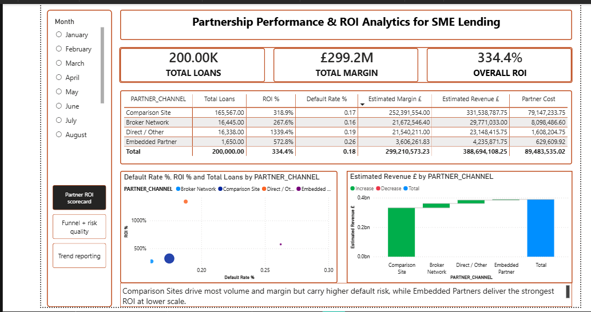
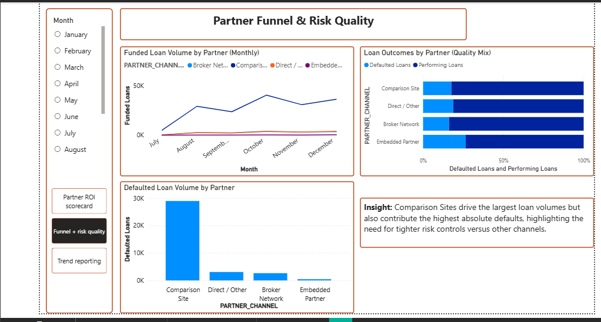
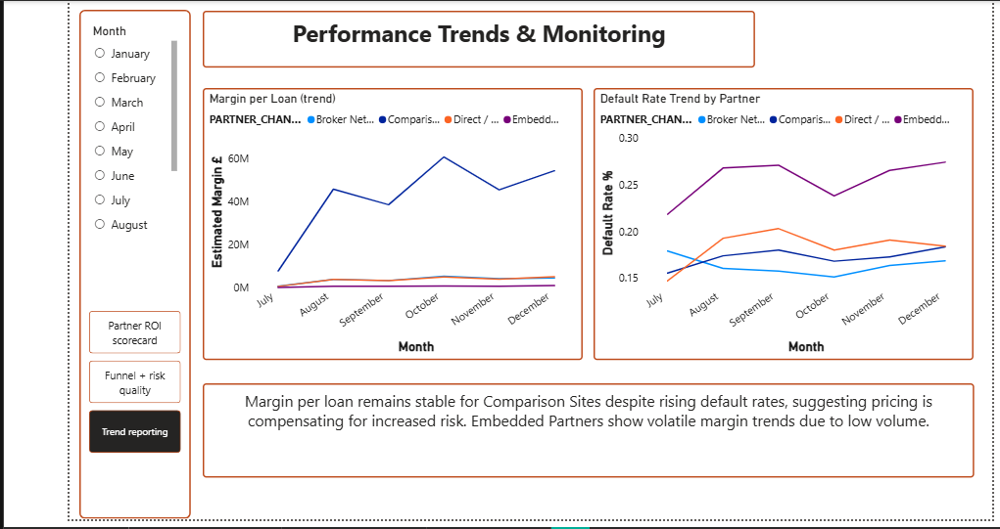

# commercial-analytics-snowflake-powerbi
Partnership performance and ROI analytics for SME lending using Snowflake and Power BI

# Partnership Performance & ROI Analytics for SME Lending

## Overview
This project demonstrates how commercial analytics can be used to evaluate
partner performance, risk quality, and return on investment (ROI) in an SME
lending context.

The analysis simulates a partnerships channel similar to those used by fintech
lenders, focusing on data-driven decision-making rather than volume alone.

The project was built to reflect the type of analysis required in a Commercial
Analyst role supporting partnerships, pricing, and growth strategy.

---

## Business Questions Answered
- Which partner channels generate the strongest ROI?
- How does credit risk vary across partners?
- Where is loan volume coming from, and is it sustainable?
- How do unit economics and risk evolve over time?

---

## Tech Stack
- **Snowflake** – data storage, transformations, and analytical views  
- **SQL** – fact tables, partner attribution, and commercial metrics  
- **Power BI** – dashboards and visual analytics  
- **GitHub** – version control and documentation  

---

## Data
- **Source:** Lending Club public loan dataset (sampled)
- **Volume:** ~200,000 loan records
- **Note:** Raw data is not included in this repository due to size and licensing

The dataset was modelled to represent an SME lending portfolio distributed
across multiple partner acquisition channels.

---

## Data Model
- **fact_loans**  
  One row per funded loan containing loan attributes, dates, and outcomes.

- **Partner Channel Attribution**  
  Partner channels are derived using loan intent and acquisition logic to
  simulate broker networks, comparison sites, embedded partners, and direct
  channels.

- **Commercial Metrics**
  - Estimated Revenue
  - Partner Cost
  - Estimated Margin
  - ROI (Margin / Partner Cost)
  - Default Rate (weighted)

All commercial metrics are calculated at query time to ensure correct
aggregation across partners and time periods.

---

## Dashboards
The Power BI dashboard contains three analytical pages:

1. **Partner ROI Scorecard**  
   High-level performance view showing ROI, margin, costs, and partner
   comparisons to support commercial decision-making.

2. **Partner Funnel & Risk Quality**  
   Analysis of funded, performing, and defaulted loans to assess risk
   concentration and funnel health by partner.

3. **Performance Trends & Monitoring**  
   Ongoing monitoring of margin per loan and default rate trends to identify
   early signs of partner performance deterioration or improvement.

## Dashboard Preview

### Page 1 — Partner ROI Scorecard

### Page 2 — Partner Funnel & Risk Quality

### Page 3 — Performance Trends & Monitoring

---

## Assumptions & Simplifications
- Revenue is estimated using loan amount and interest rate
- Partner costs are proxied using commission-style assumptions by channel
- ROI is defined as Estimated Margin divided by Partner Cost
- The model is simplified for analytical demonstration purposes and does not
  include cost of capital or operational expenses

---

## Key Insights
- Comparison Sites drive the majority of loan volume and margin but contribute
  the highest absolute defaults.
- Embedded Partners deliver the strongest ROI on lower volumes, indicating
  high-quality but less scalable partnerships.
- Monitoring margin per loan alongside default rates provides early warning
  signals of partner-level risk or pricing pressure.

---

## Future Improvements
- Migration to a Looker semantic layer
- More granular partner-level attribution
- Inclusion of expected loss and cost of capital modelling
- Automated monitoring and alerting for partner performance shifts
